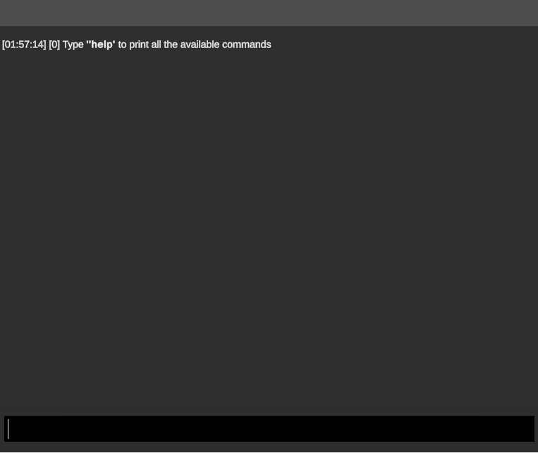

# Unity Developer console
Developer Console for Unity with drag and drop integration.



# Development notice
This asset is no longer in active development, so use at your own risk.

# Get started
1. Import via the Unity package manager (Window>Package Manager).  
Git URL: https://github.com/Blowerlop/Unity-Developer-console.git
2. Drag & drop the Console prefab into your scene.
3. Add the attribute ``[ConsoleCommand()]`` attribute to your static methods like below. See [Examples.cs](https://github.com/Blowerlop/Unity-Developer-console/blob/main/Assets/_Project/Samples~/Examples/Scripts/Example.cs) for all examples.
4. In game, press the tilde key ``~`` to toggle the console window.

# Features

# Native commands
- ``show`` - Show the console
- ``hide`` - Hide the console
- ``clear`` - Wipe all the logs in the console
- ``help`` / ``commands`` - Display all the commands
- ``find`` - Find all commands related to search text

# Examples
```C#
using UnityEngine;
using DeveloperConsole;

public class Example : MonoBehaviour
{
    [ConsoleCommand(nameof(ExampleCommand_NoArgs), "Example command with no args")]
    private static void ExampleCommand_NoArgs()
    {
        Debug.Log($"This is the {nameof(ExampleCommand_NoArgs)}");
    }
        
    [ConsoleCommand(nameof(ExampleCommand_SingleArg), "Example command with a single arg")]
    private static void ExampleCommand_SingleArg(int arg1)
    {
        Debug.Log($"This is the {nameof(ExampleCommand_SingleArg)} with arg1: {arg1}");
    }
        
    [ConsoleCommand(nameof(ExampleCommand_TwoArgs), "Example command with a two args")]
    private static void ExampleCommand_TwoArgs(int arg1, string arg2)
    {
        Debug.Log($"This is the {nameof(ExampleCommand_TwoArgs)} with arg1: {arg1} and arg2: {arg2}");
    }
}
```
